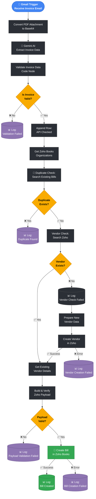

<div align="center">

# 🚀 AI-Powered Invoice Automation Platform

**An end-to-end Intelligent Document Processing (IDP) pipeline that turns a raw invoice email into a verified, audited ERP bill — with zero manual entry.**

<br/>


</div>

---

## 📌 Project Overview

**AI-Powered Invoice Automation Platform** is a production-ready workflow built entirely on **n8n**, using **Google Gemini** for AI extraction and the **Zoho Books API** as the ERP backend. It automates the complete lifecycle of an invoice — from the moment it lands in a Gmail inbox to the moment a verified, duplicate-checked bill appears in the accounting system.

Every invoice email is read, parsed by AI, validated against financial rules, checked for duplicates, matched (or created) against a vendor, and finally posted as a Zoho Books bill — with every outcome, success or failure, written to a Google Sheets audit log.

**Processed 100+ invoices end-to-end · 95%+ AI extraction accuracy · 80% reduction in manual effort.**

<br/>

<div align="center">

| 📧 Ingestion | 🤖 AI Extraction | ✅ Validation | 🔁 Duplicate Check | 👥 Vendor Resolution | 🧾 Bill Creation | 📊 Audit Log |
|:---:|:---:|:---:|:---:|:---:|:---:|:---:|
| Gmail Trigger | Google Gemini | Financial Rules | Zoho Books Search | Auto-Match / Auto-Create | Zoho Books API | Google Sheets |

</div>

--- 
## ❗ Problem Statement
 
Organizations receive hundreds of invoices from different vendors every day. Since each vendor follows a different invoice format, accounting teams often spend significant time manually reviewing invoices, extracting information, verifying totals, checking for duplicate entries, creating vendor records, and entering bills into ERP systems.
 
This manual process introduces several challenges:
 
 - Time-consuming invoice processing
- Human data-entry errors
- Duplicate invoice creation
- Inconsistent vendor records
- Financial reconciliation issues
- Limited audit visibility
As invoice volume increases, these problems become difficult to manage manually.
 
---
 
## 💡 Solution
 
This project solves these challenges by building an end-to-end AI-powered Intelligent Document Processing (IDP) platform.
 
The workflow automatically:
 
- Receives invoice PDFs from Gmail
- Extracts structured invoice information using Google Gemini
- Validates financial consistency
- Detects duplicate invoices
- Resolves or creates vendors automatically
- Creates ERP bills in Zoho Books
- Maintains complete audit logs
- Benchmarks workflow performance against ground-truth datasets
The result is a production-style automation pipeline that significantly reduces manual effort while improving data quality and process reliability.
 
---

## ⭐ Key Features

- 📧 **Gmail-triggered ingestion** — no manual upload required
- 🤖 **AI-powered extraction** using Google Gemini (`gemini-2.5-flash-lite`)
- ✅ **Financial validation engine** for every extracted invoice
- 🔁 **Duplicate invoice detection** before any bill is created
- 👥 **Automatic vendor resolution** — reuses existing vendors or creates new ones on the fly
- 🧾 **Zoho Books bill creation** with a fully verified payload
- 📊 **Google Sheets audit logging** at every decision point — success *and* failure
- 🛡 **Fail-safe branching** — validation, duplicate, vendor, and payload failures each get their own logged path, so nothing fails silently

---
### 🖼 n8n Workflow: Here's the actual n8n canvas, showing every node and branch exactly as built:

 
 
---

## 🏗 System Architecture

> This diagram is written in **Mermaid**, so it renders as an actual flowchart directly on GitHub (no image needed for this part) — colored by stage, with every decision branch and failure path shown explicitly.



## 🔄 n8n Workflow — Step by Step

### 1. Ingestion
- **Gmail Trigger (Receive Invoice Email)** — listens for incoming invoice emails
- **Convert PDF Attachment to Base64** — prepares the PDF for the Gemini API payload

### 2. AI Extraction
- **Gemini AI** (`POST https://generativelanguage...`) — extracts structured invoice fields (vendor, invoice number, dates, line items, subtotal, tax, grand total, currency)
- **Validation Invoice Data** (Code node) — normalizes and structurally validates the Gemini response
- **Is Invoice Valid?** (IF node) — routes valid invoices forward; invalid ones are logged and stopped

### 3. Organization / API Check
- **Append Row** — logs that the invoice passed the API check
- **HTTP Request (Get Zoho Books Organizations)** — confirms the correct Zoho organization context for downstream calls

### 4. Duplicate Detection
- **Duplicate Check (Search Bills)** — searches existing Zoho bills for a matching invoice number/vendor
- **If Duplicate Exists?** (IF node)
  - **True** → **Append Row in Sheet** (duplicate logged, workflow stops)
  - **False** → proceeds to vendor resolution

### 5. Vendor Resolution
- **HTTP Request — Vendor Check** — queries Zoho Books for the vendor
- **If (Does Vendor Exist?)** (IF node)
  - **True** → **Get Existing Vendor Details**
  - **False** → **Log Vendor Check Failure** → **Prepare New Vendor Data** → **Create New Vendor in Zoho**
    - **Success** → continues to payload building
    - **Error** → **Log Vendor Creation Failure**

### 6. Payload Construction & Validation
- **Build & Verify Zoho Payload** (Code node) — assembles the final bill payload with the resolved vendor ID and validated line items
- **Is Zoho Payload Valid?** (IF node)
  - **False** → **Log Payload Validation Failure**
  - **True** → proceeds to bill creation

### 7. ERP Bill Creation
- **Create Bill for Clarity** (`POST https://www.zohoapis...`) — creates the final bill in Zoho Books
  - **Success** → **Append Row in Sheet 1** (bill creation logged)
  - **Error** → **Log Zoho Bill Creation Failure**

### 8. Audit Trail
Every branch writes to a dedicated Google Sheets log: API Checked, Duplicate, Vendor Check Failure, Vendor Creation Failure, Payload Validation Failure, and Bill Creation (success/failure). Every invoice that enters the system has a traceable outcome, even if it never reaches Zoho Books.

---
## ⚙️ Tools & Technology

| Category | Stack |
|---|---|
| **Workflow Automation** | n8n (cloud-hosted, `rohit21f.app.n8n.cloud`) |
| **AI / LLM** | Google Gemini API — `gemini-2.5-flash-lite` |
| **ERP / Accounting** | Zoho Books API |
| **Email Ingestion** | Gmail Trigger (n8n) |
| **Data Handling** | Base64 PDF encoding, JSON transformation |
| **Audit & Logging** | Google Sheets API |
| **Core Logic** | n8n Code nodes (JavaScript) for validation & payload building |

**Language:** JavaScript (n8n Code nodes) · JSON (data contracts between nodes)
---

## 🧩 Design Highlights

- **Fail-safe branching** — every decision point (validity, duplicate, vendor, payload) has an explicit failure path with its own log, instead of a single generic error handler
- **Idempotency by design** — the duplicate-check step runs *before* any vendor or bill mutation, preventing double billing
- **Self-healing vendor resolution** — the workflow doesn't just fail on an unknown vendor; it creates one automatically and continues the same run
- **Two-stage validation** — invoice data is validated once right after extraction, and the Zoho payload is validated again right before the API call, catching errors introduced during transformation

---
## 📊 Impact / Benchmark Highlights

<div align="left">

| Metric | Result |
|:---|:---:|
| Invoices Processed | **100+** |
| AI Extraction Accuracy | **95%+** |
| Manual Effort Reduction | **80%** |
| Duplicate Detection | ✅ Implemented |
| Financial Validation | ✅ Implemented |
| Automatic Vendor Creation | ✅ Implemented |
| Audit Logging | ✅ Every branch logged to Sheets |

</div>

# 💼 Business Impact

The platform eliminates repetitive invoice processing tasks and improves accounting efficiency by:

- Reducing manual invoice entry by approximately 80%
- Preventing duplicate bill creation
- Improving invoice processing consistency
- Automatically resolving vendor records
- Providing complete workflow auditability
- Measuring AI performance using benchmark datasets

## 📁 Project Structure

```text
AI_Invoice_Processing_Automation/
│
├── Benchmark_Automation/        # Scripts that run the workflow against test invoice batches
│
├── dashboard/                   # Power BI / reporting dashboard assets
│
├── docs/                        # Documentation, architecture notes, and screenshots
│   └── screenshots/
│       └── n8n_workflow_overview.png
│
├── Evaluation/                  # Accuracy & KPI evaluation engine (ground-truth comparison)
│
├── Invoice_100_Test/             # 100-invoice benchmark test set + results
│
├── workflow/                    # Exported n8n workflow JSON
│   └── Invoice_Automation.json
│
├── .env                          # API keys & environment variables (not committed)
├── .gitignore
└── Readme.md
```

---

## 🔮 Future Improvements

- OCR fallback (Tesseract) for scanned/non-selectable PDFs
- Confidence scoring on Gemini extractions with a human-in-the-loop review queue for low-confidence invoices
- Multi-currency and multi-language invoice support
- Power BI / Grafana dashboard on top of the Google Sheets audit log
- Move audit logging from Sheets to a proper database for scale

---

<div align="center">

</div>
